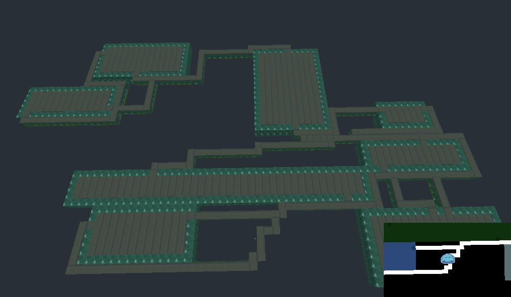

# Godot Room Generation

Procedurally generated rooms and corridors in 2D and 3D using the Binary Space Partitioning algorithim.
Uses generic textures for map, it could probably look prettier.
Programmed for Godot_v3.5.1.

Features:
* Procedurally generated room and corridors given a seed
* Functioning mini-map
* Debug mode showing the ASCII representation of map

## Example Output

### SEED 22

### SEED 22 Debug Mode

### SEED 22 Inside

### SEED 21

### SEED 25

